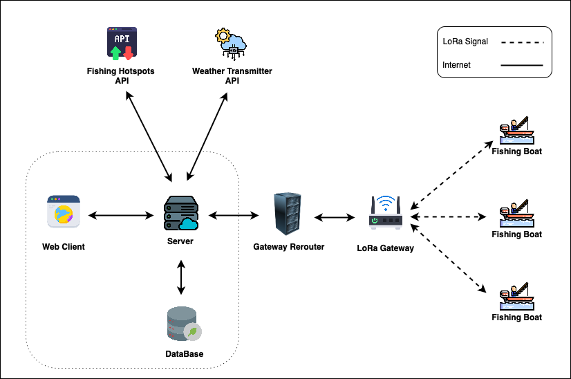

# Aquesafe_webApplication

The Aquesafe Web Application is an integrated platform designed to address the unique challenges faced by small fishing vessels, particularly those operating in remote and resource-constrained maritime environments. By leveraging advanced technologies such as LoRa, the platform provides real-time tracking, long-range communication, and actionable data insights to enhance maritime safety, operational efficiency, and regulatory compliance. With a focus on affordability, low-power consumption, and user-friendly tools, Aquesafe empowers small-scale fishers to access critical information for safe and efficient operations, bridging the technological gap and promoting sustainable fishing practices..

---

## Features

- **Data Optimization and Security Algorithms** - The system implements advanced data compression techniques to minimize the size of transmitted messages, ensuring efficient use of limited bandwidth in LoRa-based communication. Additionally, lightweight encryption and checksum validation are applied to safeguard the integrity and confidentiality of data during transmission.
- **GPS-Based Vessel Location Tracking and Visualization** - The system provides real-time tracking of fishing vessels using GPS data, allowing users to visualize vessel locations on a map. This ensures efficient monitoring and management of vessel movements.
- **Route Recording and Data Processing** - The application processes data from onboard nodes to generate accurate fishing boat route records. This allows users to review past routes for better decision-making and route optimization.
- **Emergency Alerts (SOS)** - The system is equipped with a feature that receives emergency SOS alerts from vessels in critical situations. This ensures that fishing vessels can quickly notify nearby support systems in case of distress.
- **Collaborative Emergency Response System** - When an SOS alert is triggered, the system checks for nearby vessels and sends alerts to them, enabling quick coordination and immediate assistance for vessels in distress.
- **Proximity Alerts** - Users are notified when vessels enter any danger zones, allowing for proactive safety measures and avoiding potential collisions or unsafe situations.
- **Real-Time Chat System with Zone-Based Chatting Options** - The system includes a real-time chat feature that allows users to communicate instantly. It supports zone-based chatting, enabling users to communicate with specific groups based on geographical areas.
- **Onboard Node Data Support** - Essential data is supplied to onboard nodes to support critical functions such as weather information and other vessel operations, enhancing overall efficiency and safety.
- **User-Friendly Dashboard** - The platform provides a comprehensive dashboard that displays key data in an intuitive format. This includes vessel locations, emergency alerts, the latest chats, and other essential information in one centralized view.

---

## System Architechture Diagram



_Figure 1: AquaSafe Web Application System Architecture_

---

## Installation

### Locally setup

- Get a git clone using `https://github.com/Lora-ResearchProject/Aquesafe_webApplication.git`
- Navigate to the root directory (Aquesafe_webApplication)
- run `npm run install-all`(For install all the dependensies in the Frontend and Backend).
- To run this project, use the command `npm start` in the root directory.

### Run Docker file

- Make the fundamental of the Docker container (Install all the dependencies that needed to run project)
- Get a git clone using `https://github.com/Lora-ResearchProject/Aquesafe_webApplication.git`
- Navigate to the root directory ( Aquesafe_webApplication )
- Enter `docker compose up`to create and image and run the container.

### Current Deployement

| Component                         | IP Addresses                   | Domain Name                                |
| --------------------------------- | ------------------------------ | ------------------------------------------ |
| Web Application ( Frontend )      | `http://159.223.194.167:9000/` | `https://app.aquasafe.fish/`               |
| Web Application ( Backend )       | `http://159.223.194.167:9001/` | `https://app.aquasafe.fish/backend/`       |
| Fishing Hotspots API ( Python )   | `http://159.223.194.167:9002/` | `https://app.aquasafe.fish/fishing-logic/` |
| Weather Transmitter API ( Python )| `http://159.223.194.167:9002/` | `https://app.aquasafe.fish/weather-api/`   |

---

## API Request and Response body Structure (gateway and server)

### Overview

This section outlines the structure of the request and response payloads for various operations handled by the gateway and server. Each section defines the fields and their corresponding purposes, along with examples of incoming and outgoing messages for clarity.

### Request and Response Structures

#### **1. Location**

Handles incoming location updates.

##### **Request Structure**

```json
{
  "id": "vesselid|messageid",
  "l": "latitude|longitude"
}
```

- **`id`**: A unique identifier combining the vessel ID and message ID. Use `0000` for no message ID.
- **`l`**: Location in latitude-longitude format.

##### **Example Request**

```json
{
  "id": "123|0000",
  "l": "80.12321|13.32432"
}
```

#### **2. SOS**

Indicates an SOS alert from a vessel.

##### **Request Structure**

```json
{
  "id": "vesselid|sosid",
  "l": "latitude|longitude",
  "s": 1
}
```

- **`id`**: Unique identifier for the vessel and SOS alert.
- **`l`**: Location in latitude-longitude format.
- **`s`**: Boolean indicating an SOS alert (`1` for yes).

##### **Example Request**

```json
{
  "id": "123|UfmCzP2",
  "l": "80.12321|13.32432",
  "s": 1
}
```

#### **3. Chat**

Handles incoming and outgoing messages between vessels.

##### **Incoming Message Structure**

```json
{
    "id": "vesselid|messageid",
    "m": message_number
}
```

- **`id`**: Identifier for the vessel and the message.
- **`m`**: Message payload as a number.

##### **Outgoing normal Message Structure**

```json
{
    "id": "vesselid|messageid",
    "m": response_message_number
}
```
##### **Outgoing special Message Structure ( m=0 )**

```json
{
    "id": "vesselid|messageid",
    "l": "latitude|longitude",
    "m": 0
}
```

##### **Example**

**Incoming Message:**

```json
{
  "id": "123|UfmCzP2",
  "m": 3
}
```

**Outgoing normal Message:**

```json
{
  "id": "123|UfmCzP2",
  "m": 4
}
```

**Outgoing special Message:**

```json
{
  "id": "123|UfmCzP2",
  "l": "80.12321|13.32432",
  "m": 0
}
```

#### **4. Weather**

Provides weather information for a location.

##### **Incoming Message Structure**

```json
{
  "id": "vesselid|messageid",
  "l": "latitude|longitude",
  "wr": 1
}
```

- **`id`**: Unique identifier for the vessel and message.
- **`l`**: Location in latitude-longitude format.
- **`wr`**: Boolean indicating a weather request (`1` for yes).

##### **Outgoing Message Structure**

```json
{
    "id": "vesselid|messageid",
    "w": weather_percentage
}
```

- **`w`**: Weather information as a percentage between 0 and 100.

##### **Example**

**Incoming Message:**
```json
{
  "id": "123|UfmCzP2",
  "l": "80.12321|13.32432",
  "wr": 1
}
```

**Outgoing Message:**
```json
{
  "id": "123|0000",
  "w": 60
}
```

#### **5. Fishing Hotspots**

Manages requests and responses related to fishing hotspots.

##### **Incoming Message (Get Fishing Location)**

```json
{
  "id": "vesselid|messageid",
  "l": "latitude|longitude",
  "f": 1
}
```

- **`id`**: Unique identifier.
- **`l`**: Location in latitude-longitude format.
- **`f`**: `1` to founded fishing location.

##### **Incoming Message (Request Nearest Fishing Location)**

```json
{
  "id": "vesselid|messageid",
  "l": "latitude|longitude",
  "f": 2
}
```

- **`f`**: `2` to request the nearest fishing location.

##### **Outgoing Message (Return Nearest Fishing Location)**

```json
{
  "id": "vesselid|messageid",
  "l": "latitude|longitude",
  "f": 3
}
```

- **`f`**: `3` indicating the response with the nearest fishing location.

##### **Examples**

**Incoming Message (Get Fishing Location):**

```json
{
  "id": "123|0000",
  "l": "80.12321|13.32432",
  "f": 1
}
```

**Incoming Message (Request Nearest Fishing Location):**

```json
{
  "id": "123|0000",
  "l": "80.12321|13.32432",
  "f": 2
}
```

**Outgoing Message (Return Nearest Fishing Location):**

```json
{
  "id": "123|0000",
  "l": "80.12321|13.32432",
  "f": 3
}
```

### Field Descriptions

| Field | Description                                                             | Example               |
| ----- | ----------------------------------------------------------------------- | --------------------- |
| `id`  | Unique identifier combining vessel ID and message ID (e.g.,`123 UfmCzP2`). | `"123 UfmCzP2"`    |
| `l`   | Location in latitude-longitude format.                                  | `"80.12321 13.32432"` |
| `s`   | SOS alert flag (`1` for yes , `0` for no).                              | `1`                   |
| `m`   | Message payload as a number.                                            | `3`                   |
| `w`   | Weather information as a percentage between 0 and 100.                  | `60`                  |
| `wr`  | Weather request flag (`1` for yes , `0` for no).                        | `0`                   |
| `f`   | Fishing hotspot actions (`1`, `2`, or `3`).                             | `2`                   |

---

## Vessel Authentication API Documentation

### 1. Vessel Registration

##### Endpoint

```
POST http://localhost:3001/api/vessel-auth/vessel-register
```

##### Request Body

```
{
  "vesselName": "vessel 001",
  "email": "ss002@gmail.com",
  "password": "1234"
}
```

##### Response

```
{
  "message": "Vessel registered successfully"
}
```

### 2. Vessel Login

##### Endpoint

```
POST http://localhost:3001/api/vessel-auth/vessel-login
```

##### Request Body

```
{
  "email": "ss002@gmail.com",
  "password": "1234"
}
```

##### Response

```
{
  "vesselId": "002",
  "message": "Login successful"
}
```
### 3. Get vessel details by vessel Id

##### Endpoint

```
GET http://localhost:3001/api/vessel-auth/<vesselId>
```

##### Response

```
{
    "email": "ss2@gmail.com",
    "vesselId": "002",
    "vesselName": "vessel-sarindu",
    "__v": 0
}
```
### 4. Change Vessel details (without password)

##### Endpoint

```
PATCH http://localhost:3001/api/vessel-auth/<vesselId>/change-details
```
##### Request Body

```
{
  "email": "ss2@gmail.com",
  "vesselName": "vessel-sarindu"
}
```

##### Response

```
{
    "message": "Vessel updated successfully"
}
```

### 5. Change Password

##### Endpoint

```
PATCH http://localhost:3001/api/vessel-auth/<vesselId>/change-password
```
##### Request Body

```
{
  "oldPassword": "ABCabc123#",
  "newPassword": "123AAABBBccc#"
}
```

##### Response

```
{
    "message": "Password changed successfully"
}
```

---
